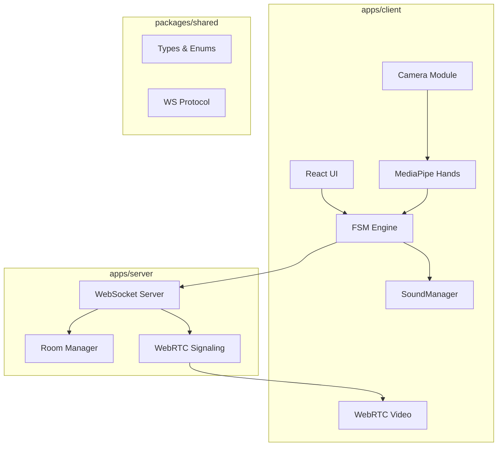

# Duels — План реализации

Браузерная 2D игра-дуэль с распознаванием жестов через веб-камеру.

## Архитектура



---

## Структура монорепозитория

```
DUELS/
├── package.json
├── pnpm-workspace.yaml
├── apps/
│   ├── client/         → Vite + React + TypeScript
│   └── server/         → Node.js + WebSocket
└── packages/
    └── shared/         → Общие типы и протоколы
```

---

## Порядок реализации

1. Монорепо — базовая структура, pnpm workspace
2. Shared — типы, протоколы, конфиг
3. FSM — логика состояний (без UI)
4. Camera — доступ к камере
5. MediaPipe — интеграция hand tracking
6. Shot detection — определение жеста выстрела
7. SoundManager — звуковая система
8. Training UI — интерфейс тренировки
9. Server — WebSocket сервер
10. Duel networking — мультиплеер
11. WebRTC — видео между игроками
12. Mobile — адаптивность
13. Polish — финальная доработка

---

## FSM States

### Training Mode
```
TRAIN_IDLE → TRAIN_READY → TRAIN_COUNTDOWN → TRAIN_WAIT_DRAW → TRAIN_DRAW → TRAIN_RESULT
```

### Duel Mode
```
DUEL_IDLE → DUEL_LOBBY → DUEL_READY → DUEL_COUNTDOWN → DUEL_WAIT_DRAW → DUEL_DRAW → DUEL_RESOLVE → DUEL_RESULT
```

---

## Конфигурация

| Параметр | Значение | Описание |
|----------|----------|----------|
| DRAW_DELAY_MIN | 2000 ms | Минимальная задержка перед DRAW |
| DRAW_DELAY_MAX | 5000 ms | Максимальная задержка перед DRAW |
| COUNTDOWN_DURATION | 3000 ms | Длительность обратного отсчёта |
| WS_PORT | 3001 | Порт WebSocket сервера |
